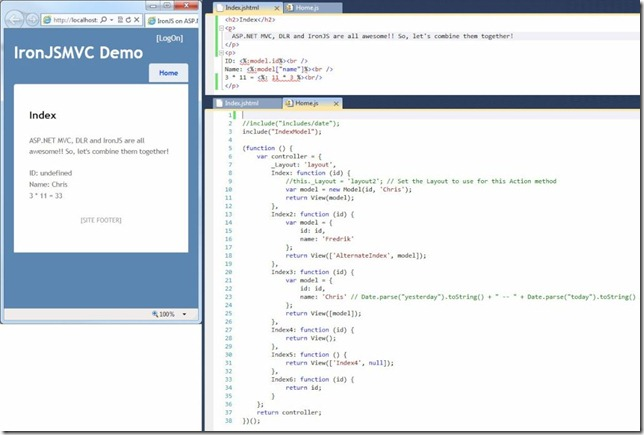

#IronJSMVC
A simple example of using the IronJS javascript library for .NET Dynamics to setup an ASP.NET MVC app to support writing Models, Views and Controllers in JavaScript.

Articles:

[IronJSMVC: Script ASP.NET MVC in JavaScript using IronJS](http://pietschsoft.com/post/2012/01/21/IronJSMVC-Script-ASPNET-MVC-in-JavaScript-using-IronJS)